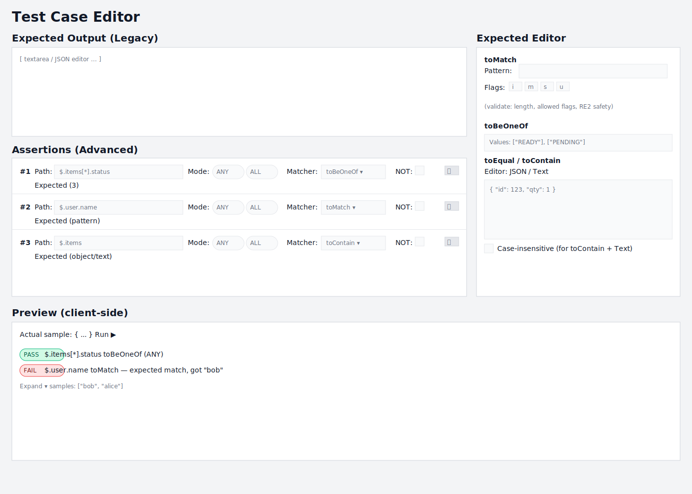

# PRD — Enhanced Test Matching for Variable LLM Outputs

Owner: PromptKitchen
Status: Draft
Date: 2025-08-08
Related: `project/PRD.md` (baseline test PRD)

## Summary
Enable flexible, matcher-based evaluation of LLM outputs. Users can define one or more assertions per test case, targeting deep JSON paths and applying familiar Jest-style matchers. This supports variable, structured outputs (strings or JSON) and allows negation via a `not` modifier. Design emphasizes extensibility to add matchers without breaking changes.

## Goals
- Allow referencing values deep in JSON (objects, arrays) using a robust path syntax.
- Provide these matchers (MVP):
  - Jest: `toEqual`, `toBeNull`, `toContain`, `toMatch`
  - jest-extended: `toBeOneOf`
  - With `not` modifier.
- Support multiple assertions per test case; test case passes if all assertions pass.
- Be easily extensible with new matchers in the future.
- Backward-compatible with existing "expected_output" exact-match/deep-equal behavior.

## Non-Goals (MVP)
- Complex logical grouping (e.g., nested anyOf/allOf groups). We default to all assertions must pass.
- Schema-validation matchers (e.g., AJV schemas), fuzzy matching, or semantic similarity.
- Tolerance-based numeric comparisons (e.g., `toBeGreaterThan`). These can be added later.

## Key Concepts
- Assertion: a single check against a value addressed by a JSON path in the actual output.
- Matcher: a function that evaluates the addressed value against expected input.
- Test Case: contains zero or more assertions; passes when all assertions pass.
- Path Match Mode ("pathMatch"): when a JSONPath resolves multiple values (e.g., wildcards), choose how to aggregate results:
  - ANY: pass if any resolved value satisfies the matcher (default).
  - ALL: pass only if all resolved values satisfy the matcher.
  This is configured per assertion.

## Path Syntax
- Use JSONPath (via `jsonpath-plus`) with `$` as root. Examples:
  - `$.user.name`
  - `$.items[0].price`
  - `$.items[*].id`
- Sugar: allow simple dot/bracket paths without `$` (we normalize internally to JSONPath).
- Resolution with multiple results: User-selectable per assertion — ANY or ALL. Default: ANY.

## Matchers (MVP)
- `toEqual(expected: any)`
  - Deep equality (object key order ignored, array order respected).
- `toBeNull()`
  - Strict check for `value === null`.
- `toContain(expected: any)`
  - If value is an array: pass if any element deep-equals expected.
  - If value is a string: pass if substring contains expected.
    - Case sensitivity: UI offers a “Case-insensitive” option. When enabled, perform case-insensitive substring match. Represented as either a plain string (case-sensitive default) or an object `{ value: string; caseInsensitive?: boolean }` in `expected`.
  - Regex is not supported — use `toMatch` for regex.
- `toMatch(pattern: string | { source: string; flags?: string })`
  - For strings only. Compile `RegExp` from pattern; pass if it matches. Regex flags are allowed (e.g., `i`, `m`, `s`, `u`).
- `toBeOneOf(options: any[])`
  - Pass if value deep-equals any element in options. Works for primitives and structured values.
- `not` modifier
  - Invert the final result of the matcher.

Error messaging: include path, matcher, expected, actual, and flags. Example: `$.user.name toMatch /[A-Z][a-z]+/ expected match, got "bob"`.

## Data Model Changes (Backward Compatible)
- Table: `test_cases`
  - New column: `assertions` TEXT (JSON-encoded array), nullable.
  - Keep existing `expected_output` and `output_type` for legacy/simple tests.
- Table: `test_results`
  - New column: `details` TEXT (JSON-encoded array of per-assertion results), nullable.
- DTO (`packages/shared`):
  - Add interfaces:

    ```ts
    export type JsonPath = string; // JSONPath string

    export type MatcherName = 'toEqual' | 'toBeNull' | 'toContain' | 'toMatch' | 'toBeOneOf';

    export type PathMatchMode = 'ANY' | 'ALL';

    export interface Assertion {
      id: string;                 // uuid
      path: JsonPath;             // e.g. $.items[0].id
      pathMatch?: PathMatchMode;  // default 'ANY'
      matcher: MatcherName;
      expected?: unknown;         // omitted for no-arg matchers like toBeNull
      not?: boolean;              // default false
      description?: string;       // optional human label
    }

    export interface TestCase { /* ...existing fields... */ assertions?: Assertion[] }
    ```

- Migrations (SQLite via Knex):
  - `010_add_assertions_to_test_cases`
    - `ALTER TABLE test_cases ADD COLUMN assertions TEXT`.
  - `011_add_details_to_test_results`
    - `ALTER TABLE test_results ADD COLUMN details TEXT`.
  - No destructive changes; evaluator will prefer `assertions` if present, else fall back to legacy logic.

## Evaluation Semantics
- If `testCase.assertions?.length > 0`:
  - For each assertion:
    - Resolve `values = jsonpathPlus(path)`.
    - If 0 results, treat as `[undefined]` (so null/undefined can be tested explicitly).
    - For each resolved value, run the matcher to get boolean(s).
    - Aggregate by `pathMatch`:
      - ANY: assertion passes if any value passes (short-circuit on first pass).
      - ALL: assertion passes only if all values pass (short-circuit on first fail).
    - Apply `not` after aggregation.
  - Test case passes if all assertions pass.
- Else (legacy):
  - Strings => exact equality.
  - JSON => deep equality.

Return rich `AssertionResult` entries for display:

```ts
export interface AssertionResult {
  assertionId: string;
  path: string;
  matcher: MatcherName;
  not: boolean;
  pathMatch: PathMatchMode;
  passed: boolean;
  actualSamples: unknown[];  // values resolved at path (sampled if large)
  message?: string;          // friendly explanation on failure
}
```

## Extensibility Design
- Central matcher registry in `packages/shared`:

```ts
export interface MatcherContext {
  deepEqual(a: unknown, b: unknown): boolean;
}

export interface Matcher {
  name: MatcherName | string; // allow future names
  arity: 'none' | 'one';      // number of expected args (MVP: 0 or 1)
  evaluate(value: unknown, expected: unknown, ctx: MatcherContext): boolean;
  describe(value: unknown, expected: unknown, not: boolean): string; // builds message
}

export const registry: Record<string, Matcher> = { /* toEqual, ... */ };
```

- New matchers are added by registering a `Matcher`. UI reads registry metadata to populate selector and expected-input editor.

## API/Service Changes
- Shared evaluator (`packages/shared/src/evaluation`):
  - `evaluateAssertions(actual: unknown, assertions: Assertion[]): { passed: boolean; results: AssertionResult[] }`
  - Expose utility: `resolveJsonPath(actual, path): unknown[]`
  - Export `registry` and matcher types.
- Backend (`packages/backend`):
  - Add `EvaluationService` that wraps shared evaluator for server-side runs.
  - Update run pipeline to generate `AssertionResult`s and overall pass/fail.
  - Persist per-test-case results as today, plus store serialized `AssertionResult[]` in `test_results.details` for richer UI.
- Frontend (`packages/frontend`):
  - Import shared evaluator for local preview in editor.

## UI/UX
- Location: enhance the existing `TestCaseEditor` within the Test Suite UI (no new page).
- Sections:
  1) Expected Output (legacy/simple) — unchanged.
  2) Assertions (Advanced) — new, optional, integrated into the existing editor.
- Assertions Editor (per row):
  - Path input with JSONPath hint and quick-pick of last run’s keys.
  - Path multi-match mode: toggle between ANY / ALL (default ANY).
  - Matcher select: `toEqual`, `toBeNull`, `toContain`, `toMatch`, `toBeOneOf`.
  - Expected value editor:
    - Auto-adapts: hidden for `toBeNull`; string input for `toMatch` (with optional flags); string/JSON toggle for others; for `toBeOneOf`, list editor.
  - Not toggle.
  - Remove row.
- Toolbar actions:
  - Add assertion.
  - Import from last actual output: scaffold rows from detected paths/values.
  - Preview run (client-side) against sample actual output.
- Results UI
  - In test run results, show per-assertion chips: Pass/Fail, path, matcher, path mode (ANY/ALL), and message.
  - Offer expand to show actual samples when path returns multiple values.

### Assertions Editor — Detailed UI Design (Wireframe, Components, Interactions)

#### Visual Wireframe (SVG)
- Inline view:



- Direct link: design/editor/testcase-assertions-editor-wireframe.svg

#### Wireframe (ASCII)
```
Test Case Editor
┌──────────────────────────────────────────────────────────────────────────────┐
│ Expected Output (Legacy)                                                     │
│ ┌──────────────────────────────────────────────────────────────────────────┐ │
│ │ [ textarea/json editor ... ]                                             │ │
│ └──────────────────────────────────────────────────────────────────────────┘ │
│                                                                              │
│ Assertions (Advanced)                               [Add] [Import] [Preview] │
│ ┌──────────────────────────────────────────────────────────────────────────┐ │
│ │ #1 ▣ drag  Path: [ $.items[*].status       ]  Mode: (● ANY ○ ALL)        │ │
│ │            Matcher: [ toBeOneOf ▾ ]  NOT: [ ]  ▸ Expected (3)            │ │
│ │            (🗑)                                                             │ │
│ ├──────────────────────────────────────────────────────────────────────────┤ │
│ │ #2 ▣ drag  Path: [ $.user.name             ]  Mode: (● ANY ○ ALL)        │ │
│ │            Matcher: [ toMatch   ▾ ]  NOT: [ ]  ▸ Expected (pattern)       │ │
│ │            (🗑)                                                             │ │
│ ├──────────────────────────────────────────────────────────────────────────┤ │
│ │ #3 ▣ drag  Path: [ $.items                 ]  Mode: (● ANY ○ ALL)        │ │
│ │            Matcher: [ toContain ▾ ]  NOT: [ ]  ▸ Expected (object/text)   │ │
│ │            (🗑)                                                             │ │
│ └──────────────────────────────────────────────────────────────────────────┘ │
│                                                                              │
│ ▾ Expected Editor (contextual side panel for the selected row)               │
│ ┌──────────────────────────────────────────────────────────────────────────┐ │
│ │ when toMatch:                                                             │ │
│ │   Pattern: / ^[A-Z][a-z]+$ /      Flags: [ i ] [ m ] [ s ] [ u ]         │ │
│ │   (validate: length, allowed flags, RE2 safety)                           │ │
│ │ when toBeOneOf:                                                           │ │
│ │   Values:  [ Add value ]  ▸ ["READY"]  ▸ ["PENDING"]  (drag to reorder) │ │
│ │ when toEqual/toContain:                                                   │ │
│ │   Editor: (• JSON ◦ Text)                                                 │ │
│ │   [ { "id": 123, "qty": 1 } ]                                          │ │
│ │   If toContain + Text: [ Case-insensitive ]                               │ │
│ └──────────────────────────────────────────────────────────────────────────┘ │
│                                                                              │
│ Preview (client-side)                                                        │
│ ┌──────────────────────────────────────────────────────────────────────────┐ │
│ │ Actual sample: { ... }      Run ▶                                         │ │
│ │ Results: [PASS] $.items[*].status toBeOneOf (ANY)                         │ │
│ │          [FAIL] $.user.name toMatch — expected match, got "bob"           │ │
│ │          Expand ▾ samples: ["bob", "alice"]                               │ │
│ └──────────────────────────────────────────────────────────────────────────┘ │
└──────────────────────────────────────────────────────────────────────────────┘
```

#### Component Structure
- TestCaseEditor (existing)
  - ExpectedOutputSection (legacy)
  - AssertionsSection (new)
    - Toolbar: Add, Import, Preview
    - AssertionList (sortable via drag handle)
      - AssertionRow (selectable; opens side ExpectedPanel)
        - PathInput with JSONPath hints/quick-pick
        - PathMatchToggle (segmented control ANY/ALL)
        - MatcherSelect (registry-driven)
        - NotToggle
        - RemoveButton
    - ExpectedPanel (single contextual side panel; docks right on wide screens, stacks on narrow)
  - PreviewPanel (optional, collapsible)

#### Form Behavior & Validation
- PathInput
  - Basic JSONPath validation on blur; normalize sugar (e.g., `user.name` -> `$.user.name`).
  - Autocomplete/quick-pick from last run’s keys (lightweight heuristic key discovery on last payload).
- PathMatchToggle
  - Defaults to ANY; stores per-assertion value.
- MatcherSelect
  - Options from shared `registry`. Disabling of incompatible choices when value is known (optional enhancement).
- Expected editor adapts to matcher:
  - toBeNull: hidden (no input).
  - toMatch: two inputs — pattern (string) and flags (checkboxes for i, m, s, u). Validate: length, allowed flags, RE2/safe-regex checks client-side mirror.
  - toEqual/toContain: JSON editor (with format/validate) or plain text. For arrays, show JSON by default. For toContain+Text, include a Case-insensitive checkbox.
  - toBeOneOf: list builder. Each item uses same value editor as toEqual. Enforce non-empty.
- Inline validation badges per row (e.g., “Invalid JSONPath”, “Pattern too long”).
- Size limits surfaced early (warn when approaching configured caps).

#### Interactions
- Add assertion: appends a new row with sensible defaults (path `$`, ANY, toEqual, NOT=false).
- Import from last output: proposes assertions based on sampled paths/values (user selects which to add).
- Select row: opens the ExpectedPanel focused on that assertion.
- Reorder: drag handle; order preserved.
- Delete: trash icon with confirm UX that avoids `window.confirm` (inline undo snackbar consistent with project’s guidance).
- Preview run: executes shared evaluator client-side against provided sample actual; renders pass/fail chips and failure messages.

#### Keyboard & Accessibility
- Full keyboard support: Tab order across fields; Space toggles ANY/ALL; Enter adds list items; Del removes focused assertion.
- ARIA labels/roles for controls; visible focus states; high-contrast safe.
- Announce validation errors via aria-live region in the ExpectedPanel.

#### Empty States & Error Handling
- Empty state copy with CTA: “No assertions yet — add one or import from last output.”
- Row-level error summaries; aggregate errors shown above toolbar when Preview is pressed with invalid rows.

#### Results Rendering (Runs View)
- Per-assertion chips: [PASS]/[FAIL], path, matcher, mode, with tooltip message.
- Expand to reveal `actualSamples` (truncated with “...truncated” marker and hash as per backend policy).

#### Responsive & Theming
- Layout uses a responsive grid: side panel on wide screens; stacked on narrow.
- Tailwind utility classes with design tokens consistent with dashboard updates.

#### Implementation Notes
- Shared evaluator and registry power both Preview and server integration to avoid drift.
- Keep state as an array of `Assertion` DTOs; serialize to JSON for persistence. `Assertion.description` remains optional in the DTO but is not surfaced in the MVP UI.
- Unit tests for UI logic (adapters/validators) with Jest and React Testing Library.

#### UI-Specific Open Questions (Resolved)
1) Docking: Use a single contextual side panel integrated into the existing TestCaseEditor. ✅
2) Description field: Not shown in the MVP UI; keep property optional for future use. ✅
3) toContain on strings: Include a Case-insensitive option (UI checkbox). ✅
4) JSON copy/paste import/export: Deferred to post-MVP. ✅

